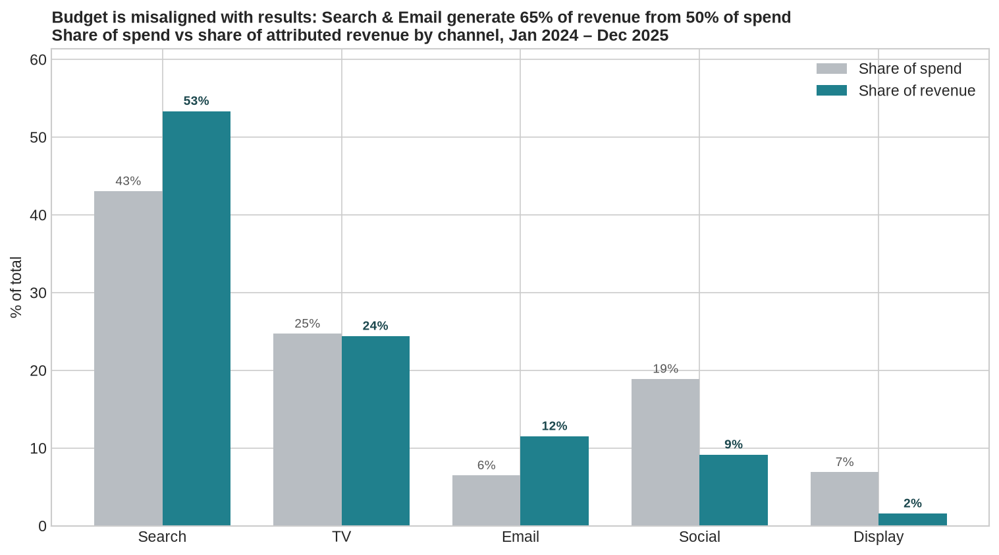
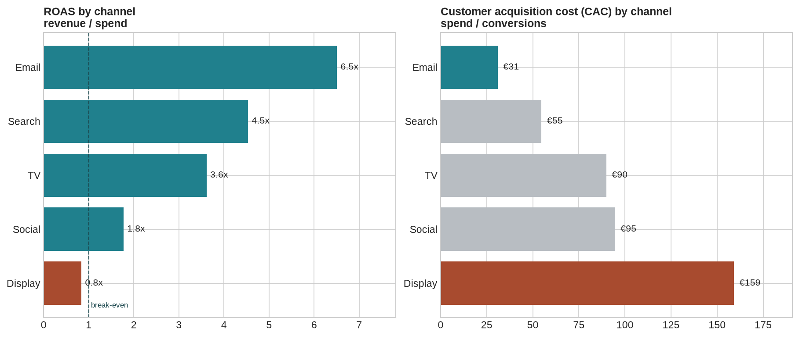
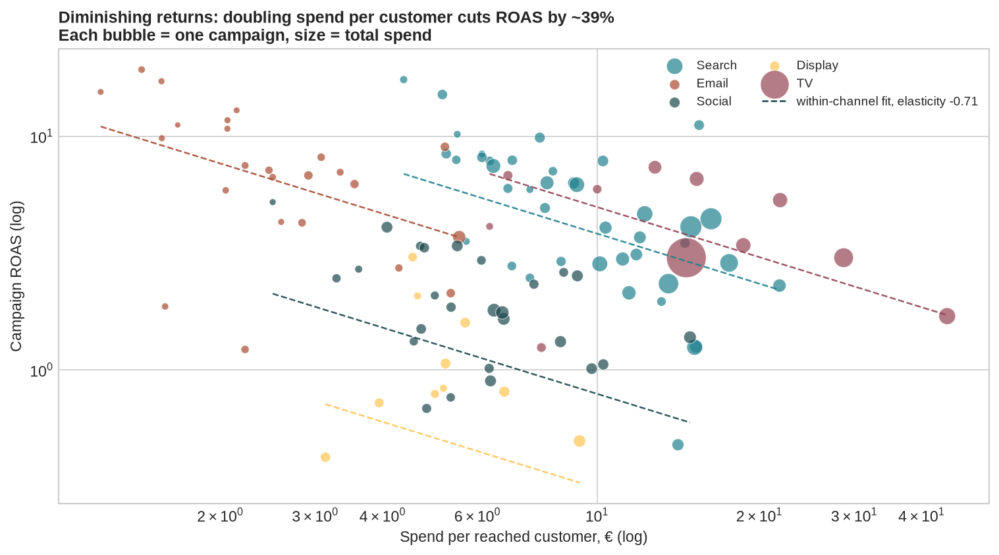
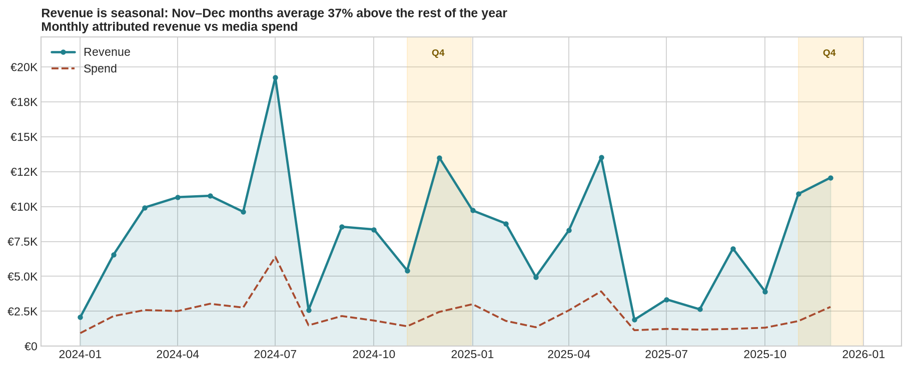
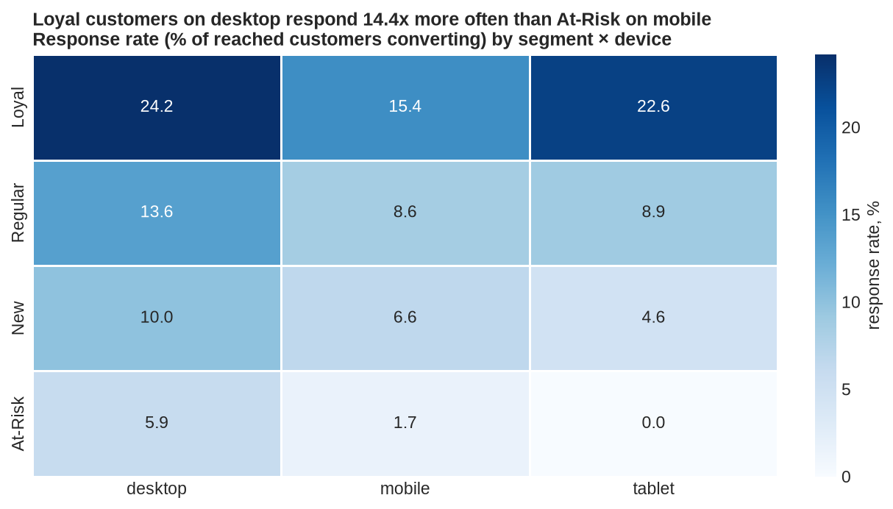
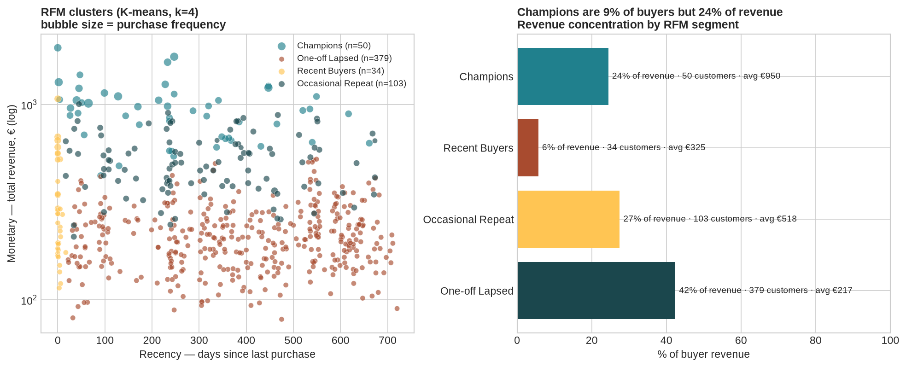
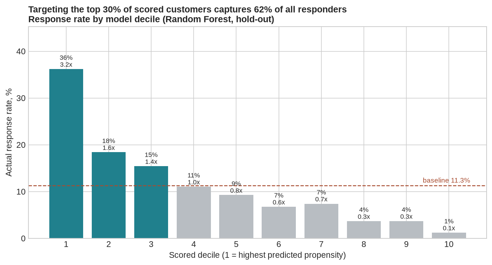
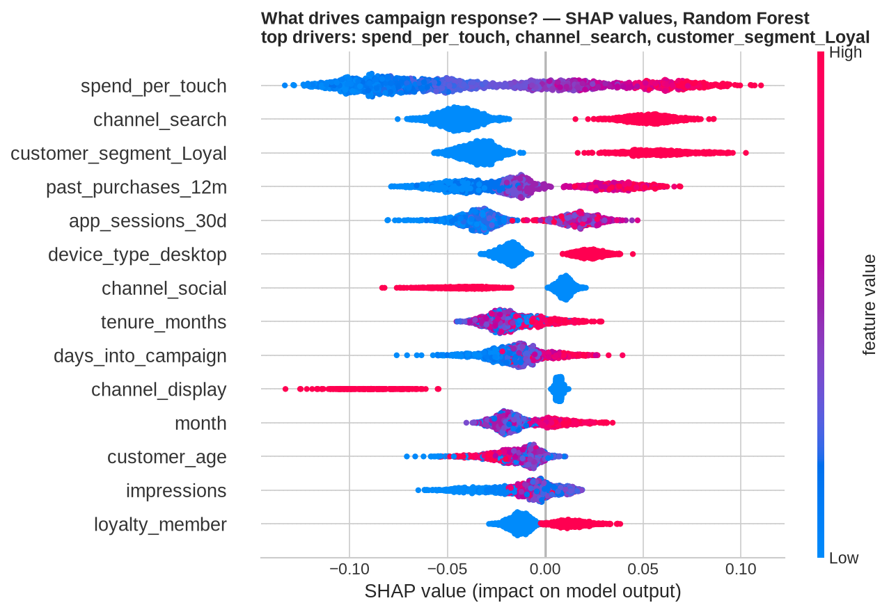
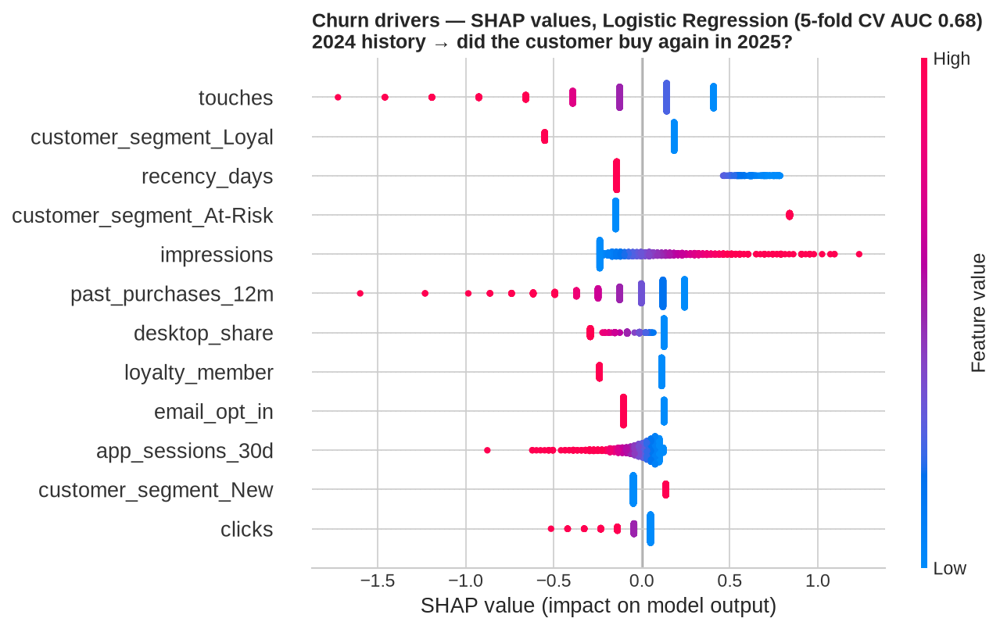

# Marketing Campaign Performance & Customer Intelligence Suite


An end-to-end marketing analytics project built on synthetic campaign and CRM data: KPI dashboards, customer segmentation, predictive models (response and churn), and an automated executive summary. It mirrors the analysis I'd run to answer one question — where should the next euro of marketing budget go.

**Key finding:** Email delivers 6.5x ROAS at a €31 CAC on just 6% of budget, while Display runs below break-even (0.84x). Shifting 10–15% of spend toward Email is estimated to add 15–20% attributed revenue at the same total budget.

<p align="center">
  
</p>

---

## Table of contents
- [What this project does](#what-this-project-does)
- [Results at a glance](#results-at-a-glance)
- [Business insights](#business-insights)
- [Customer segmentation (RFM + K-means)](#customer-segmentation-rfm--k-means)
- [Predictive models](#predictive-models)
- [Power BI / Qlik data model](#power-bi--qlik-data-model)
- [AI-insight layer](#ai-insight-layer)
- [Repository structure](#repository-structure)
- [Quick start](#quick-start)
- [Methodology notes](#methodology-notes)
- [Limitations & next steps](#limitations--next-steps)

---

## What this project does

| Stage | What happens | Output |
|---|---|---|
| 1. Data | Generates a synthetic dataset: 6,503 campaign x customer touches, 120 campaigns, 5 channels (Search, Email, Social, Display, TV), 2,200 customers, Jan 2024 - Dec 2025, with built-in channel economics, Q4 seasonality and diminishing returns. | `data/raw/` |
| 2. KPI & EDA | Computes CTR, CVR, CPC, CAC, ROAS, AOV and response rate by channel, segment, region, device, age group, month and campaign; produces 8 charts and 5 quantified insights. | `outputs/kpi_by_*.csv`, `outputs/charts/`, `outputs/insights.json` |
| 3. Machine learning | RFM segmentation (K-means), campaign-response propensity model (Logistic Regression vs Random Forest vs XGBoost, with SHAP and decile lift), 12-month churn model. | `outputs/models/` |
| 4. BI export | Star schema (2 fact + 5 dimension tables) as CSV and Excel, plus DAX measures for Power BI and equivalent Qlik master measures. | `data/powerbi/` |
| 5. AI insights | A narrative generator that writes a 5-paragraph executive summary strictly from validated numbers (optional LLM mode). | `outputs/executive_summary.md` |
| 6. Report | 12-page stakeholder PDF: Executive Summary, Methodology, KPI Dashboard, Segmentation, Predictive Models, Recommendations, Appendix. | `report/` |

---

## Results at a glance

| Metric | Value |
|---|---|
| Media spend | €53.1K across 120 campaigns |
| Attributed revenue | €194.4K (804 conversions, AOV €242) |
| Blended ROAS / CAC | 3.7x / €66 |
| Customers reached / response rate | 2,032 / 11.3% |
| Best channel | Email — ROAS 6.5x, CAC €31, 6% of spend |
| Weakest channel | Display — ROAS 0.84x, CAC €159 |
| Diminishing returns | within-channel elasticity -0.71: doubling spend per customer cuts ROAS by ~39% |
| Seasonality | Nov-Dec revenue is ~1.4x an average month |
| Response model | Random Forest, hold-out ROC-AUC 0.75, top-decile lift 3.2x |
| Churn model | Logistic Regression, 5-fold CV AUC 0.68; 76% of 2024 buyers did not repurchase in 2025 |
| Segmentation | RFM + K-means (k=4): Champions are 9% of buyers but 24% of revenue |

### Channel KPI table

| Channel | Spend | Revenue | Conv. | CTR | CVR | Response rate | CAC | ROAS |
|---|---:|---:|---:|---:|---:|---:|---:|---:|
| Email | €3,440 | €22,384 | 111 | 8.5% | 32% | 8.5% | €31 | 6.51x |
| Search | €22,860 | €103,679 | 418 | 12.6% | 36% | 17.4% | €55 | 4.54x |
| TV | €13,120 | €47,433 | 146 | 0.6% | n/a* | 15.5% | €90 | 3.62x |
| Social | €10,030 | €17,786 | 106 | 5.3% | 17% | 6.2% | €95 | 1.77x |
| Display | €3,660 | €3,070 | 23 | 1.6% | 16% | 3.4% | €159 | 0.84x |

\*TV conversions are brand-driven rather than click-attributed, so click-to-conversion isn't meaningful here.

<p align="center">
  
</p>

---

## Business insights

1. Email is efficient but under-funded — 6.5x ROAS and the lowest CAC (€31) on only 6% of spend. Shifting 10-15% of budget into lifecycle/re-engagement email is the highest-ROI reallocation available.
2. Display loses money — €3,660 spent for €3,070 returned, with a 16% click-to-conversion rate. Pause prospecting display and keep only retargeting.
3. Diminishing returns are measurable — a log-log regression of campaign ROAS on spend-per-reached-customer (with channel fixed effects) gives an elasticity of -0.71. Some of the largest Social and Search flights sit past the efficient frontier; splitting them into smaller waves would recover efficiency.
4. Q4 is worth 1.4x an average month — front-load Q4 spend and keep an always-on minimum through the July-August low.
5. The CRM base is the cheapest growth lever — Loyal customers respond at 18.7% vs 3.2% for At-Risk; Retention/Cross-sell campaigns average 4.5x ROAS vs 2.7x for Acquisition.

<p align="center">
  
  
  
</p>

---

## Customer segmentation (RFM + K-means)

566 buyers were clustered on log-scaled, standardised Recency/Frequency/Monetary features. k=4 was chosen for interpretability (silhouette scores: k=3 → 0.58, k=4 → 0.52, k=5 → 0.37). The remaining 1,634 reached customers never purchased and form a separate Prospect group.

| Segment | Customers | Avg recency (days) | Avg purchases | Avg revenue | Share of buyer revenue | Playbook |
|---|---:|---:|---:|---:|---:|---|
| Champions | 50 | 252 | 3.4 | €950 | 24% | VIP service, early access, frequency caps |
| Recent Buyers | 34 | 2 | 1.4 | €325 | 6% | 30-day onboarding, cross-sell a 2nd category |
| Occasional Repeat | 103 | 310 | 2.0 | €518 | 27% | Reactivation cadence tied to purchase cycle |
| One-off Lapsed | 379 | 395 | 1.0 | €217 | 42% | Email-first win-back, suppress from paid prospecting |

<p align="center">
  
</p>

---

## Predictive models

### Campaign response propensity
Will a reached customer convert? Interaction-level grain, base rate 11.3%, 18 features including leakage-safe history features (only events strictly before each touch), evaluated with 5-fold stratified CV plus a 25% hold-out.

| Model | CV ROC-AUC | Hold-out ROC-AUC | Hold-out PR-AUC |
|---|---:|---:|---:|
| Logistic Regression | 0.725 ± 0.032 | 0.746 | 0.318 |
| Random Forest | 0.717 ± 0.028 | 0.747 | 0.302 |
| XGBoost | 0.700 ± 0.027 | 0.725 | 0.287 |

Contacting only the top 3 scored deciles captures 62% of responders (top-decile lift 3.2x) — a direct lever on CAC and customer fatigue. SHAP shows high spend-per-touch pushes predictions down (diminishing returns), while Search and Loyal push predictions up.

<p align="center">
  
  
</p>

### Churn / retention
Did the customer buy again in 2025, given their 2024 behaviour? 1,644 customers reached in 2025; features are 2024 touches, purchases, revenue, recency, CTR, channel and device mix plus static attributes. Logistic Regression (CV AUC 0.68 ± 0.05) edges out Gradient Boosting (0.68 ± 0.04). Scores are binned into Low/Medium/High risk bands and joined to `dim_customers` for the dashboard. Strongest signals: number of touches, Loyal segment, days since last purchase, loyalty membership.

<p align="center">
  
</p>

---

## Power BI / Qlik data model

`data/powerbi/` contains a ready-to-load star schema (CSV + `marketing_star_schema.xlsx`):

```
                 dim_dates ──┐
             dim_channels ───┤
            dim_campaigns ───┼──▶ fact_campaign_interactions  (6,503 rows; spend, impressions, clicks, conversions, revenue, responded)
            dim_customers ───┤        ▲
         (RFM segment,       │        │ campaign_id / channel_id
          churn risk band)   └──▶ fact_campaigns  (120 rows; pre-aggregated CTR, CVR, CAC, ROAS, profit, spend_per_customer)
             dim_segments ──▶ dim_customers
```

`measures_dax.txt` has 25 measures — core KPIs (ROAS, CAC, Response Rate, Spend Share, Revenue Share, Share Gap), time intelligence (Revenue PY, Revenue YoY%, Rolling 3M Revenue), and customer-intelligence measures (High Churn Risk Customers, Champions Revenue). `measures_qlik.txt` mirrors them as Qlik Sense master measures.

---

## AI-insight layer

`src/05_ai_insights.py` turns the KPI tables and model results into a 5-paragraph executive summary (Headline, What worked, What didn't work, Customer intelligence, Recommendations). `build_facts()` assembles a single JSON fact payload, and `generate_executive_summary()` renders it as rule-based prose that only uses numbers computed by the analytics layer — so the summary can't invent a figure. An optional LLM mode (`generate_executive_summary_llm()`) sends the same payload to an OpenAI-compatible model for richer wording, with a rule-based fallback.

See the generated output in [`outputs/executive_summary.md`](marketing_intelligence_suite/outputs/executive_summary.md).

---

## Repository structure

```
marketing_intelligence_suite/
├── src/
│   ├── 01_generate_data.py        synthetic data with realistic structure
│   ├── 02_kpi_eda.py              KPI framework, 8 charts, insights.json
│   ├── 03_ml_models.py            RFM / K-means, response model, churn model, SHAP, lift
│   ├── 04_export_star_schema.py   fact_* / dim_* CSV + Excel, DAX & Qlik measures
│   ├── 05_ai_insights.py          executive-summary generator (rule-based + optional LLM)
│   └── 06_build_report.py         12-page PDF report (ReportLab)
├── data/
│   ├── raw/                       marketing_interactions.csv, campaigns_master.csv, customers_master.csv, customer_rfm_segments.csv
│   └── powerbi/                   7 star-schema tables, marketing_star_schema.xlsx, measures_dax.txt, measures_qlik.txt
├── outputs/
│   ├── charts/                    13 PNG charts
│   ├── models/                    model_results.json, feature importances, decile lift, churn scores, *.joblib
│   ├── kpi_by_*.csv               KPI tables by channel / segment / region / device / month / campaign / age
│   ├── insights.json              5 quantified business insights
│   └── executive_summary.md       AI-generated executive summary
├── report/
│   └── Marketing_Campaign_Performance_Report.pdf
├── requirements.txt
└── run_all.sh
```

---

## Quick start

```bash
git clone https://github.com/<your-username>/marketing-intelligence-suite.git
cd marketing-intelligence-suite
pip install -r requirements.txt
bash run_all.sh            # runs steps 01 → 06, ~2-3 min on a laptop
```

Run a single stage, e.g. only the models: `python src/03_ml_models.py`.
Optional LLM mode for the summary: set `OPENAI_API_KEY` and call `generate_executive_summary_llm(build_facts())`.

All scripts are seeded (`random_state=42`), so every table, chart and metric here is reproducible.

---

## Methodology notes

- KPI definitions: CTR = clicks/impressions, CVR = conversions/clicks, Response rate = converting customers/reached customers, CAC = spend/conversions, ROAS = revenue/spend, AOV = revenue/conversions.
- Diminishing returns: `log(ROAS) ~ log(spend per reached customer)` with channel fixed effects, so the cheap-but-efficient Email channel doesn't bias the slope.
- Leakage control: history features for the response model (prior touches/conversions/revenue) are cumulative sums shifted to exclude the current touch. The churn model uses a strict time split (2024 features → 2025 label).
- Explainability: SHAP TreeExplainer for tree models, LinearExplainer for logistic regression.

---

## Limitations & next steps

- The dataset is synthetic (designed to mirror realistic CRM/media data) and uses last-touch attribution — a production version would need multi-touch or incrementality testing.
- Model AUCs (0.75 / 0.68) are realistic for this depth of data; real deployments should use time-based splits and periodic re-calibration.
- Natural next steps: a marketing-mix model for budget optimisation, uplift modelling for treatment targeting, and a published `.pbix` with screenshots.
